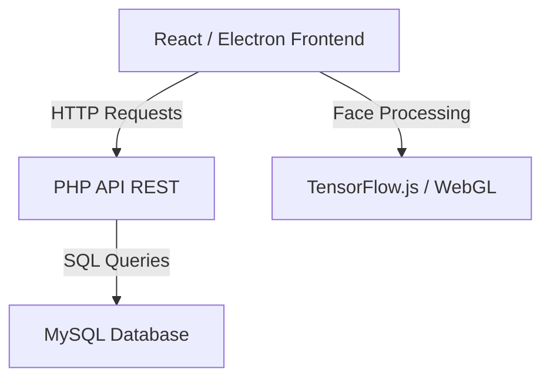

# 🎓 Akıllı Yoklama Takibi
**Yapay Zeka Destekli Yüz Tanıma ve Yoklama Yönetim Sistemi**

[Özellikler](#-özellikler) • [Teknolojiler](#-teknolojiler) • [Mimari](#-mimari) • [Kurulum](#-kurulum) • [Proje Yapısı](#-proje-yapısı) • [API](#-api-endpoints)

---

## 📖 Genel Bakış
**Akıllı Yoklama Takibi**, üniversiteler ve eğitim kurumları için geliştirilmiş, yüz tanıma teknolojisi (Face Recognition) kullanan modern bir yoklama yönetim sistemidir. Geleneksel kağıt-kalem yoklamalarını ortadan kaldırarak, öğrencilerin sınıfa girdiklerinde kameralar aracılığıyla otomatik olarak tanınmasını ve yoklamanın anlık olarak veritabanına işlenmesini sağlar.

Sistem; Yönetici, Öğretmen ve Öğrenci olmak üzere üç farklı kullanıcı rolünü destekler ve her biri için özelleştirilmiş paneller sunar.

---

## ✨ Özellikler

| Özellik | Açıklama |
| :--- | :--- |
| **🤖 Yüz Tanıma** | `face-api.js` ve `TensorFlow.js` kullanarak yüksek doğrulukla kimlik doğrulama |
| **🔐 Rol Tabanlı Giriş** | Yönetici, Öğretmen ve Öğrenci için güvenli ve ayrıştırılmış paneller |
| **📊 Anlık Takip** | Yoklamaların saniyesinde sisteme düşmesi ve raporlanması |
| **📅 Ders Yönetimi** | Derslerin, sınıfların ve öğretmen atamalarının kolayca yönetimi |
| **📱 Cross-Platform** | Hem Web tarayıcısında hem de Masaüstü (Electron) uygulaması olarak çalışma |
| **📈 İstatistikler** | Katılım oranları ve ders bazlı raporlar |

---

## 🛠️ Teknolojiler

| Katman | Teknoloji |
| :--- | :--- |
| **Dil** | TypeScript, PHP |
| **Frontend** | React, Vite |
| **Styling** | TailwindCSS, Lucide React |
| **Desktop** | Electron |
| **Yapay Zeka** | face-api.js, TensorFlow.js |
| **Backend** | PHP (Native) |
| **Veritabanı** | MySQL / MariaDB |
| **HTTP Client** | Axios / Fetch API |

---

## 🏗️ Mimari
Proje, istemci-sunucu (client-server) mimarisine dayanır. Frontend, yüz işleme ve kullanıcı arayüzünü yönetirken; Backend veritabanı işlemlerini ve API servislerini sağlar.



- **Frontend**: Yüz verilerini tarayıcı üzerinde işler (Edge Computing), sadece kimlik bilgilerini sunucuya gönderir.
- **Backend**: İstemciden gelen verileri doğrular ve veritabanına kaydeder.

---

## 🚀 Kurulum (Getting Started)

### Gereksinimler
- **Node.js** 18 veya üzeri
- **XAMPP** (veya ayrı ayrı PHP 8.x ve MySQL)
- **Git**

### Adım Adım Kurulum

1. **Projeyi Klonlayın**
   ```bash
   git clone https://github.com/dogukantoprak/akilli-yoklama-takibi.git
   cd akilli-yoklama-takibi
   ```

2. **Veritabanını Hazırlayın**
   - XAMPP Control Panel'den **Apache** ve **MySQL** servislerini başlatın.
   - `http://localhost/phpmyadmin` adresine gidin.
   - `smart_attendance` adında yeni bir veritabanı oluşturun.
   - Proje içindeki `db/smart_attendance.sql` dosyasını içe aktarın (Import).
   - (Opsiyonel) Demo veriler için `db/seed.sql` dosyasını da içe aktarın.

3. **Backend Yapılandırması**
   - Backend API varsayılan olarak `localhost:8079` portunda çalışacak şekilde ayarlanmıştır.
   - Terminalde proje klasöründeyken şu komutu çalıştırarak PHP sunucusunu başlatın:
     ```bash
     php -S localhost:8079 -t .
     ```

4. **Frontend Kurulumu ve Başlatma**
   - Yeni bir terminal açın ve bağımlılıkları yükleyin:
     ```bash
     npm install
     ```
   - Uygulamayı başlatın:
     ```bash
     npm run dev
     ```
   - Masaüstü (Electron) sürümü için:
     ```bash
     npm run dev:desktop
     ```

---

## 📁 Proje Yapısı

```
akilli-yoklama-takibi/
├── db/                         # Veritabanı şemaları ve seed dosyaları
├── public/
│   └── models/                 # Yüz tanıma yapay zeka modelleri
├── smart_attendance_api/       # PHP Backend API kodları
│   ├── config.php              # Veritabanı ayarları
│   ├── index.php               # API Router
│   └── ...                     # Diğer endpointler
├── src/                        # React Frontend kodları
│   ├── components/             # Yeniden kullanılabilir bileşenler
│   ├── pages/                  # Sayfalar (Login, Dashboard vb.)
│   ├── services/               # API servisleri
│   ├── utils/                  # Yardımcı fonksiyonlar
│   ├── App.tsx                 # Ana uygulama bileşeni
│   └── main.tsx                # Entry point
├── electron-main.cjs           # Electron ana işlem dosyası
├── index.html                  # HTML şablonu
├── package.json                # Proje bağımlılıkları
└── vite.config.ts              # Vite yapılandırması
```

---

## 🌐 API Endpoints

Uygulama arka plan ile aşağıdaki REST endpoint'leri üzerinden haberleşir:

| Metot | Endpoint | Açıklama |
| :--- | :--- | :--- |
| `POST` | `/login.php` | Kullanıcı girişi ve token oluşturma |
| `POST` | `/register.php` | Yeni kullanıcı kaydı |
| `GET` | `/courses.php` | Ders listesini getirir |
| `POST` | `/create_course.php` | Yeni ders oluşturur |
| `POST` | `/record_attendance.php` | Yüz tanıma sonrası yoklama kaydı atar |
| `GET` | `/attendance.php` | Yoklama listesini getirir |
| `GET` | `/stats.php` | Genel istatistikleri sunar |
| `GET` | `/students.php` | Öğrenci listesi |
| `GET` | `/teachers.php` | Öğretmen listesi |

---

## 🔧 Yapılandırma

**Frontend (`.env`):**
API adresi `VITE_API_BASE` değişkeni ile yönetilir. Varsayılan: `http://localhost:8079/smart_attendance_api`

**Backend (`smart_attendance_api/config.php`):**
Veritabanı bağlantı ayarları burada bulunur.

```php
return [
    'db_host' => '127.0.0.1',
    'db_name' => 'smart_attendance',
    'db_user' => 'root',
    'db_pass' => '',
];
```

---

## 🤝 Katkıda Bulunma

Katkılarınızı bekliyoruz! Başlamak için:

1. Bu depoyu fork'layın.
2. Yeni bir özellik dalı (branch) oluşturun (`git checkout -b feature/harika-ozellik`).
3. Değişikliklerinizi commit'leyin (`git commit -m 'Harika özellik eklendi'`).
4. Dalınızı push'layın (`git push origin feature/harika-ozellik`).
5. Bir Pull Request açın.

---

## 📄 Lisans

Bu proje eğitim amaçlı geliştirilmiştir. Detaylar için `LICENSE` dosyasına bakabilirsiniz.
